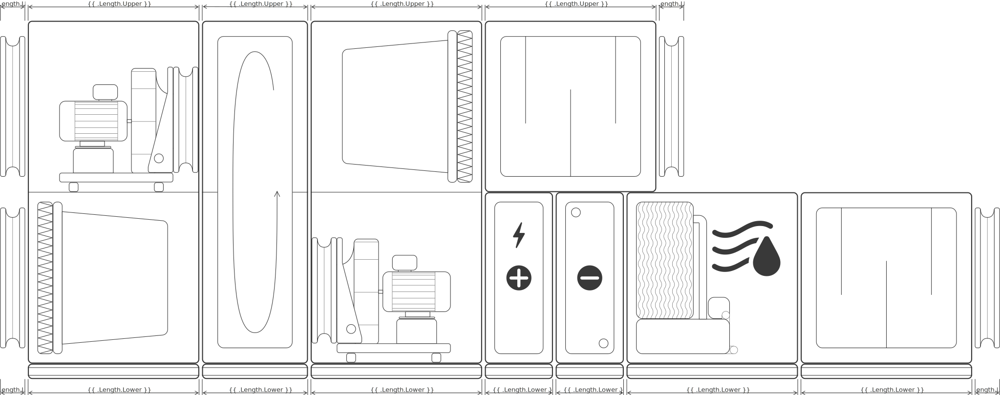

[](https://github.com/nikk-gr/svgJoin/actions/workflows/ci.yml)
[](https://codecov.io/gh/nikk-gr/svgJoin)

# svgJoin
The go library for combining svg images

Three steps required to join pictures
1. Parse original svg `svgJoin.Parse()`
2. Join parsed pictures `svgJoin.Join()`
3. Export resulting picture `svgJoin.Draw()`

Use the following command to get it:
```bash
go get github.com/nikk-gr/svgJoin
```

# Types
## Chunk
**svgJoin.Chunk** is the result of parsing svg string. It contains body of svg file and size data. Can be joined and exported.
## Group
**svgJoin.Group** is the result of joining pictures. Contains pictures and auxiliary data. Can be joined and exported.

# Functions and methods
## Parse
`Parse(svg string)(result Chink, err error)` prepare picture to the following join. Error returns if svg have invalid <svg…> tag. Deeper structure is not checked.

## Join
`Join(direction, align, offset, parts) (Group, error)` combine `Chunks` and other `Groups` into `Groups`.

The Following directions are possible:
1. right to left `svgJoin.Leftward`
2. left to right `svgJoin.Rightward`
3. top to bottom `svgJoin.Downward`
4. bottom to top `svgJoin.Upward`

The following alignments are available for the first two directions:
1. `svgJoin.Top`
2. `svgJoin.Middle`
3. `svgJoin.Bottom`


and the second two:
1. `svgJoin.Left`
2. `svgJoin.Middle`
3. `svgJoin.Right`


Offset is a distance between the parts. Offset can be negative.


Parts is a `Group` and `Chunk` array

## Draw 
`(s Part)Draw()(svg string, err error)` convert `Group` or `Chunk` to svg `string`

# Code examples
Code is available in blackbox_test.go
## First Example
```go
package main

import (
	"github.com/nikk-gr/svgJoin"
	"log"
	"os"
)

func main() {
	// Make arrays of pictures paths
	
	Names := []string{
		"./testdata/EH.svg",
		"./testdata/CW.svg",
		"./testdata/WMH.svg",
		"./testdata/STS2.svg",
		"./testdata/FC2.svg",
	}

	// Read pictures from paths and parse it
	Parts := make([]svgJoin.Part, len(Names))

	for i := 0; i < len(Names); i++ {
		file, err := os.ReadFile(Names[i])
		if err != nil {
			log.Fatal(err.Error())
		}
		Parts[i], err = svgJoin.Parse(string(file))
		if err != nil {
			log.Fatal(err.Error())
		}
	}

	// Join pictures
	Result, err := svgJoin.Join(svgJoin.Rightward, svgJoin.Top, 10, Parts...)
	if err != nil {
		log.Fatal(err.Error())
	}

	// Draw result svg
	var svg string
	svg, err = Result.Draw()

	// Save to file
	_ = os.WriteFile("Result2.svg", []byte(svg), 770)
}
```


## Second Example
```go
package main

import (
	"github.com/nikk-gr/svgJoin"
	"log"
	"os"
)

func main() {
	// Make arrays of pictures paths
	upperNames := []string{
		"./testdata/STS1.svg",
		"./testdata/FC1.svg",
	}
	lowerNames := []string{
		"./testdata/EH.svg",
		"./testdata/CW.svg",
		"./testdata/WMH.svg",
		"./testdata/STS2.svg",
		"./testdata/FC2.svg",
	}
	leftNames := []string{
		"./testdata/FC3.svg",
		"./testdata/FVS1.svg",
		"./testdata/RR0.svg",
		"./testdata/FVS2.svg",
	}

	// Read pictures from paths and parse it
	upperParts := make([]svgJoin.Part, len(upperNames))
	lowerParts := make([]svgJoin.Part, len(lowerNames))
	leftParts := make([]svgJoin.Part, len(leftNames))

	for i := 0; i < len(upperNames); i++ {
		file, err := os.ReadFile(upperNames[i])
		if err != nil {
			log.Fatal(err.Error())
		}
		upperParts[i], err = svgJoin.Parse(string(file))
		if err != nil {
			log.Fatal(err.Error())
		}
	}
	for i := 0; i < len(lowerNames); i++ {
		file, err := os.ReadFile(lowerNames[i])
		if err != nil {
			log.Fatal(err.Error())
		}
		lowerParts[i], err = svgJoin.Parse(string(file))
		if err != nil {
			log.Fatal(err.Error())
		}
	}
	for i := 0; i < len(leftNames); i++ {
		file, err := os.ReadFile(leftNames[i])
		if err != nil {
			log.Fatal(err.Error())
		}
		leftParts[i], err = svgJoin.Parse(string(file))
		if err != nil {
			log.Fatal(err.Error())
		}
	}

	// Join pictures
	var (
		UpperRight, LowerRight, Left, Right, Result svgJoin.Group
		err                                         error
	)
	UpperRight, err = svgJoin.Join(svgJoin.Rightward, svgJoin.Top, 10, upperParts...)
	if err != nil {
		log.Fatal(err.Error())
	}
	LowerRight, err = svgJoin.Join(svgJoin.Rightward, svgJoin.Bottom, 10, lowerParts...)
	if err != nil {
		log.Fatal(err.Error())
	}
	Right, err = svgJoin.Join(svgJoin.Downward, svgJoin.Left, 0, UpperRight, LowerRight)
	if err != nil {
		log.Fatal(err.Error())
	}
	Left, err = svgJoin.Join(svgJoin.Rightward, svgJoin.Bottom, 10, leftParts...)
	if err != nil {
		log.Fatal(err.Error())
	}
	Result, err = svgJoin.Join(svgJoin.Rightward, svgJoin.Bottom, 10, Left, Right)
	if err != nil {
		log.Fatal(err.Error())
	}

	// Draw result svg
	var svg string
	svg, err = Result.Draw()

	// Save to file
	_ = os.WriteFile("Result.svg", []byte(svg), 770)
}
```

